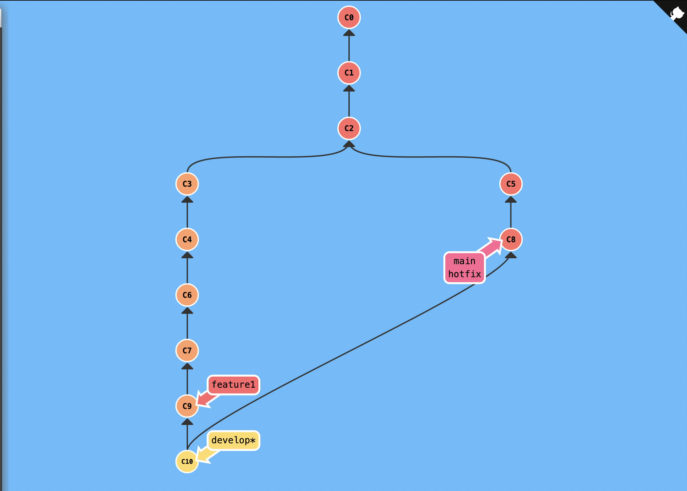

DevOps Engineer 
=========================================

This challenge consists of multiple practical parts, As a DevOps engineer you need to always read, explore and implement multiple solutions. That's why we tried creating a simple practical task. 


### Git Challenge

* Git is a wide used distributed version control system in which you will need to interact with and use daily. 

* Git is about practicing all the way, So let's jump into action for this challenge. 


#### Git Challenge #1

##### Steps

* First of all, Go through [this](https://learngitbranching.js.org/) link and start exploring the lessons if you don't have prior Git knowledge. 
	* This app is made for testing and learning purposes to simulate and visualize your git commits

* We need to reproduce the following Git commits shown in the PNG.
 
***Note:*** You need to open the [Sandbox](https://learngitbranching.js.org/?NODEMO) mode in order to be able to test and examine in a free session. 

You can refer to their GitHub [repo](https://github.com/pcottle/learnGitBranching) for more info about the product and how to use.  

##### Expected Output
  * You should provide an image that contains the commits and their outputs. 
  * You should also provide the commits in a text file as well, So we are able to reproduce and trace your commits.

#### Git Challenge #2

##### Steps

* Second Git challenge is that you need to write a one page blog about Git and Git workflows. 
  * Try to make it neat as much as possible by separating the post into multiple paragraphs
  * You can consult all the external resources to help you understand and right the blog without copying exact paragraphs from the internet. 
  * Any novice engineer should understand what is Git and Git workflows from your blog.


##### Expected Output
* You should provide a one page blog written as Text/Markdown separated as paragraphs.
  * Try to write as much lines as possible from your understanding to what you have read or know. Avoid copy paste already written stuff. 
  * Don't forget as we need this to assess your written English skills for establishing the documentation.


Compress all files and folders from the two challenges with the following formula ```YourName-Git-challenge-date.zip```

### Containers

Containers are currently used heavily in all modern cloud based applications. And as a DevOps engineer you will be working with containers and orchestration tools daily.

#### Containers Challenge #1

##### Steps

* Write a simple app that calculates the factorial of a random number between 1-10 in any language (C, C++, NodeJs, Golang, Rust or Python etc...)
* After you get your code running, You need to Dockerize the application. 
* Please mention any best practices you used or can be used for dockerizing the application in terms of container security, Image size and Image layers caching

##### Expected Output

* You should provide the application code file.
* You should also provide the Dockerfile.
* You should provide a Markdown file stating the container best practices part.

#### Containers Challenge #2 (Bonus Challenge)

##### Steps
* You need to deploy this application on a k8s cluster

##### Expected Output

* You should deliver k8s manifest files that you used to deploy the application on cluster. 
  * We assume that you are using a ready provisioned cluster, If not please specify what is your k8s installation and how did you manage to do it in a Mark down file. 


Compress all files and folders from the two challenges with the following formula ```YourName-Containers-challenge-date.zip```


### General Linux & Debugging Questions

#### Challenge #1 

##### Steps
* Imagine that you are working as a DevOps engineer for a product based company and you suddenly encountered slow behaviour reported from the users. 
* The problem is occurring reguraly and it's a web application, How would you think to debug and check the issue? 
  * This is an open ended question and you need to assume all the missing information from your side. Feel free to write as much details as you can. 

##### Expected Output
* You should deliver a Markdown file that contains the steps and details for debugging the problem

#### Challenge #2 
Finally we are up to our last challenge!. A set of shell scripts on HackerRank that you need to solve. 
##### Steps
* Visit the following link and solve [this](https://www.hackerrank.com/challenges/bash-tutorials-filter-an-array-with-patterns/problem) shell challenge 

##### Expected Output
* The output is expected to be one or more screenshot that present the following.
 * Successfull submission of the problem on HackerRank
 * The solution you submitted

#### Challenge #3 (Bonus Challenge)

##### Steps
* Visit the following link and solve [this](https://www.hackerrank.com/challenges/lonely-integer-2/problem?isFullScreen=true)

##### Expected Output
* The output is expected to be one or more screenshot that present the following.
 * Successfull submission of the problem on HackerRank
 * The solution you submitted

Compress all files and folders from the three challenges with the following formula ```YourName-Linux-challenge-date.zip```

### How Do We Evaluate

We love perfection and we are a team with very challenging tasks all the way. That's the spirit we want and we are looking for. 
You are not gonna do a job for fixed hours, You are gonna do something exciting for a while everyday.

That's the Spirit! 

- **Simplicty**, write simple, clean code, Complexity is Human Programmer's Enemy
- **Correctness**, always focus on what output we asked for in the task
- **Security**, no one loves to be vulnerable, so we are. That's why you need to check the best practices to apply any security measurements
- **Testing**, we care about testing and your solutions should be well tested and wokring before submission. Otherwise, Mention all the details that let to failure
- **Documentation**, we love documentation, We need to establish our infrastructure documentation part and that's why we included the Git blog post part
